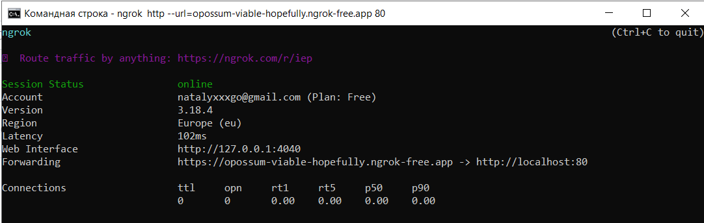

# Personal-Development-Assistant-Server
## Инструкция по запуску сервера
### Разверните базу данных
1. Запустите cmd из папки source/tomcat.
2. Для задания кодировки выполните:
```
set PGCLIENTENCODING=UTF8
```
3. Для создания БД:
```
psql -U postgres -h localhost -p 5432 -f scripts/create_db.sql
```
4. Для заполнения БД:
```
psql -U postgres -h localhost -p 5432 -f scripts/manual_pop.sql
```
5. Если понадобится очистить БД (например, при смене схемы), то:
```
psql -U postgres -h localhost -p 5432 -f scripts/drop_db.sql
```
### Запустите приложение
1. Убедитесь, что у вас установлены: Java 17, Tomcat 9, Maven 3.
2. Перейдите в папку source/tomcat.
3. Если пароль пользователя postgres отличается от qwerty, то в файле src/main/resources/application.properties отредактируйте:
```
spring.datasource.password=вашпароль
```
4. Из папки source/tomcat запустите:
```
mvn spring-boot:run
```

## Информация по адресам
Полная документация в Postman.
* Адрес приложения: http://localhost:8080/assistant
* Адрес для информации на 3 дня на главном экране: http://localhost:8080/assistant/api/{year}/{month}/{day}
* Адрес для работы с задачами: http://localhost:8080/assistant/api/tasks (примеры запросов в source/tomcat/http_req_examples)

## Удалённый доступ (Настройка для запуска со своего устройства)
### Настройка ngrok

1. Установите ngrok: https://download.ngrok.com/windows?tab=download
2. Зарегистрируйте аккаунт на https://ngrok.com/
3. Зарегистрируйте authtoken в cmd: 
```
ngrok config add-authtoken <token>
```

### Запуск туннеля

1. В cmd выполнить:
```
ngrok http --url=opossum-viable-hopefully.ngrok-free.app 80
```
```
ngrok http --url=opossum-viable-hopefully.ngrok-free.app --host-header=rewrite "localhost:8080"
```
2. Получать информацию по ссылке после поля Forwarding (подставлять в ссылки как ngrok https://opossum-viable-hopefully.ngrok-free.app/assistant/api/tasks):


## Удалённый доступ (Уже запущено на устройстве)

1. Добавить заголовок ко всем исходящим с фронтенда запросам:
```
ngrok-skip-browser-warning: true
```

2. Получить данные по предоставленной ссылке: https://opossum-viable-hopefully.ngrok-free.app вместо http://localhost:8080